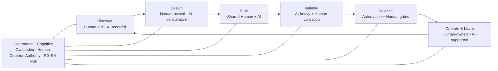

# 01 Level 1 – Development Landscape

## AI-Augmented Software Development Lifecycle (AI-SDLC)

**Four-level process model inspired by C4: Landscape → Process → Specification → Playbook.**

> **Human ownership always remains. AI augments engineering work — it does not replace engineering accountability.**

AI-SDLC is a **human-owned, AI-augmented model of software delivery**. Human ownership, decision authority and accountability remain throughout the lifecycle, while the level of AI participation changes according to the nature and risk of the work.

AI is used aggressively where execution can be safely delegated, constrained and independently validated. Design, material engineering decisions, definition of correctness, risk acceptance and production accountability remain human-owned.

## Hero Visual — Development Landscape

The landscape is intentionally a presentation layer. It should be usable as a single large slide for executive, engineering and onboarding discussions, while acting as the entry point for deeper zoom levels defined below.

## 1. How to read the Landscape

Level 1 answers one question:

> **How do we work with GenAI overall?**

It shows:

* the major areas of the software lifecycle,
* the dominant Human/AI participation model in each area,
* where AI autonomy expands and where it contracts,
* the role of the R0–R4 risk model,
* the cross-cutting constitutional guardrails,
* the production feedback loop that closes the lifecycle.

It deliberately does **not** define detailed execution procedures, checklists, prompts, implementation contracts or test mechanics.

**L1 describes the operating model, not the execution procedure.**

## 2. Lifecycle Overview

| Phase | Purpose | Human / AI operating mode | Main outcome |
| --- | --- | --- | --- |
| **Discover** | Understand the problem, shape the opportunity and establish useful context | **Human-led + AI-assisted** | Validated problem and requirement context |
| **Design** | Decide how the solution should work and how it will be recognized as correct | **Human-owned · AI consultative** | Approved design, test intent and implementation intent |
| **Build** | Turn the approved design into working, reviewed software | **Shared Human + AI** | Reviewed implementation that satisfies the defined contract |
| **Validate** | Build independent evidence that the solution is functionally and non-functionally acceptable | **AI-heavy + Human validation** | Acceptance evidence |
| **Release** | Safely promote the trusted artifact through environments into production | **Automation + Human gates** | Verified production release with recovery capability |
| **Operate & Learn** | Observe reality, respond to failures and feed evidence back into development | **Human-owned + AI-supported** | Metrics, incidents, feedback, lessons learned and new ideas |

### Discover

Typical activities:

**Idea → Discovery → Analysis**

Humans provide the business context, intent, priorities and judgement. AI is highly useful for clarification, synthesis, documentation, detecting gaps and converting meeting outcomes into usable engineering artifacts.

### Design

Typical activities:

**Architecture → Refinement → Planning → Test Design → Implementation Design**

This is intentionally the most strongly human-owned area of the lifecycle. AI may act as a consultant, sparring partner, reviewer or documentation assistant, but architecture, decomposition, material trade-offs, domain modelling, acceptance intent and important implementation decisions remain human-owned.

### Build

Typical activities:

**AI Implementation Contract → Implementation → Author Review → AI Review → Human Review → Pair Review**

Human design and constraints make controlled delegation possible. AI may perform substantial implementation and verification work, while the developer retains the mental model, reviews the resulting code and remains accountable for the outcome.

### Validate

Typical activities:

**Functional Tests → Manual Tests → E2E → Exploratory → NFR**

AI may perform a large share of test mechanics, automation and result analysis. Humans retain ownership of test intent, critical acceptance, exploratory judgement and the decision that evidence is sufficient.

E2E is selective rather than a 1:1 automation of all manual tests; the broader test pyramid and non-functional validation remain essential.

### Release

Typical activities:

**Build Once → Promote Artifact → INT → QA → PREPROD → Release Gate → PROD → Smoke → Observation**

The preferred model is **build once, verify and promote the same trusted artifact**. Automation should perform most repeatable release mechanics, while risk-appropriate human gates remain responsible for material GO / NO-GO, known-risk acceptance and recovery decisions.

### Operate & Learn

Typical activities:

**Metrics → Incidents → Feedback → Lessons Learned → New Ideas**

Production is not the end of the lifecycle. Technical telemetry, business metrics, support signals, incidents and user feedback become inputs to the next iteration.

AI may assist with correlation, synthesis, anomaly analysis and converting observations into actionable knowledge. Humans retain operational accountability and decide what the evidence means for the product and engineering system.

## 3. The Human–AI Operating Model

AI participation is deliberately **not uniform** across the lifecycle.

The landscape uses several operating modes:

* **Human-owned** — humans own the activity and material decisions; AI may still be used as a supporting tool.
* **Human-owned · AI consultative** — humans clearly own the work, while AI is explicitly encouraged as a reviewer, challenger, sparring partner or analytical assistant.
* **Human-led + AI-assisted** — humans lead the process and decide what matters; AI performs significant supporting work.
* **Shared Human + AI** — humans define the intent, constraints and important decisions while AI may execute substantial parts of the work.
* **AI-heavy + Human validation** — AI may perform most of the repeatable mechanics, but humans retain validation authority and accountability.
* **Automation + Human gates** — deterministic automation and AI perform execution while humans retain risk-appropriate decision gates.

Two distinctions are fundamental:

> **Human-owned does not mean AI prohibited.**

> **AI-heavy does not mean AI accountable.**

Participation describes the degree of execution involvement. It does not transfer ownership, decision authority or accountability.

## 4. Why AI involvement changes across the lifecycle

AI involvement does not increase linearly from idea to production.

It intentionally contracts in **Design**, where work depends heavily on business context, domain understanding, engineering trade-offs, architecture and decision authority. It expands again in **Build** and especially **Validate**, where the human team has already defined the problem, constraints, contracts and validation intent.

This leads to one of the central ideas of AI-SDLC:

> **The better humans define intent, constraints and correctness, the more safely execution can be delegated to AI.**

Conceptually:

**Problem understanding → Human design → Explicit constraints → Test intent → Bounded AI execution → Independent validation**

AI-SDLC therefore does not ask, "How much AI can we use?" It asks, **"Where is autonomy valuable, bounded and safe?"**

## 5. Risk-Based AI Autonomy

AI-SDLC uses the cross-cutting **R0–R4 Risk Model**:

* **R0 — Trivial / Mechanical:** high AI autonomy may be appropriate.
* **R1 — Standard:** moderate-high AI autonomy with normal engineering controls.
* **R2 — Significant:** shared execution with stronger human control and independent validation.
* **R3 — High Risk:** restricted AI autonomy with explicit human gates and stronger safeguards.
* **R4 — Critical:** human-first execution with tightly bounded AI support.

The direction is simple:

> **Higher risk = narrower AI autonomy + stronger independent controls.**

Risk classification affects the complete lifecycle, not only coding. It influences the depth of analysis, architecture rigor, AI delegation, validation, review, release strategy, observability and recovery requirements.

For detailed criteria and mandatory controls, see [**05 Risk Model R0–R4**](../05-risk-model/).

## 6. Foundational Guardrails

The Development Landscape is governed by a set of cross-cutting principles that apply across every lifecycle phase and every risk class:

* **Human accountability**
* **Cognitive ownership**
* **Human decision authority**
* **Bounded AI autonomy**
* **Human-defined correctness**
* **Transparency & traceability**
* **Security / privacy / legal boundaries**
* **Production safety & recoverability**
* **Continuous evaluation**

These guardrails are not optional decorative principles. They define the boundaries within which the process, specifications and playbooks may operate.

For the constitutional baseline, see [**00 Principles & Governance**](../00-principles/).

## 7. What does Done mean?

AI-SDLC uses a production-oriented Definition of Done:

> **Done = deployed, verified and operating correctly in production.**

A merged pull request is not Done.

A successful deployment is not Done.

A release becomes Done only after sufficient evidence confirms that it is deployed correctly, critical smoke paths succeed and production observation does not show unacceptable technical or business degradation.

For material releases, credible recoverability is part of delivery quality rather than an afterthought.

## 8. The lifecycle is a loop

The final phase deliberately reconnects to the first:

**Production → Metrics / Incidents / Feedback → Learning → New Ideas / Discovery → …**

Reality in production is treated as a source of engineering truth. Escaped defects, operational behavior, user feedback and business outcomes must be allowed to change requirements, tests, playbooks, risk controls and even AI-SDLC itself.

This closes the lifecycle and supports continuous improvement rather than one-way feature delivery.

## 9. Where to zoom next

| If you want to understand… | Zoom to… |
| --- | --- |
| How the complete delivery process flows, including major artifacts, owners and gates | [**02 Level 2 – Development Process Map**](../02-process-map/) |
| What exactly must happen in an individual lifecycle step | [**03 Level 3 – Process Specifications**](../03-process-specifications/) |
| How a human, team, tool or agent should execute the work | [**04 Level 4 – Engineering Playbooks**](../04-playbooks/) |
| Why Human/AI boundaries and governance rules exist | [**00 Principles & Governance**](../00-principles/) |
| How AI autonomy and controls change from R0 to R4 | [**05 Risk Model R0–R4**](../05-risk-model/) |
| How the value and side effects of AI-SDLC are measured | [**06 Metrics & Evaluation**](../06-metrics/) |

---

> **Landscape principle:** Humans own the engineering. AI participation expands where intent, constraints and validation become explicit — and contracts again where risk requires stronger human control.
