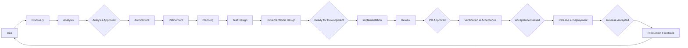
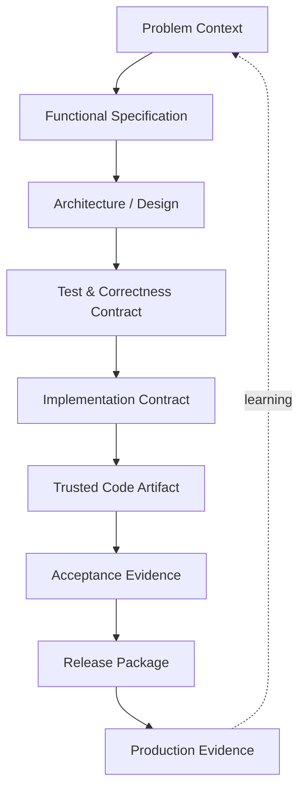

# 02 Level 2 – Development Process Map

Level 2 defines the **logical process contract** of AI-SDLC.

It answers:

> **How does work move through the lifecycle, which artifacts carry the context forward, who owns the important decisions, and which gates must be passed before the work may continue?**

L2 is intentionally **tool-agnostic**. It defines logical states, artifacts, responsibilities and gates. Their implementation in Jira, Azure DevOps, GitHub, GitLab, Confluence, CI/CD platforms or other tools belongs to lower levels of AI-SDLC and to organization-specific adapters and playbooks.

**Logical state ≠ tool status.**

## Visual 1 — Overall Development Process Map

## 1. How to read Level 2

Level 2 is a zoom into the Landscape defined at L1.

The six major process groups remain the same:

**Discover → Design → Build → Validate → Release → Operate & Learn → Discover**

At L2, each group is described through five logical dimensions:

**Purpose → Activities → Artifacts → Ownership → Gate**

The model does **not** require every artifact to exist as a separate document or file. An artifact represents a required unit of engineering information or evidence. A gate is a **logical state transition**, not a mandatory workflow status in a specific tool.

## 2. End-to-End Process Overview

| Phase | Purpose | Human / AI operating model | Primary outcome | Primary gate |
| --- | --- | --- | --- | --- |
| **Discover** | Understand the problem and shape the opportunity | **Human-led + AI-assisted** | Validated problem and requirement context | **Analysis Approved** |
| **Design** | Decide how the solution should work and how correctness will be defined | **Human-owned · AI consultative** | Approved design, test intent and implementation intent | **Ready for Development** |
| **Build** | Turn the approved design into reviewed, trusted implementation | **Shared Human + AI** | Reviewed source change and implementation evidence | **PR Approved** |
| **Validate** | Establish sufficient evidence that the change behaves correctly | **AI-heavy + Human validation** | Acceptance evidence | **Acceptance Passed** |
| **Release** | Promote the trusted artifact safely into production | **Automation + Human gates** | Verified and accepted production release | **Ready for Production / Release Accepted** |
| **Operate & Learn** | Observe production reality and convert it into learning and new work | **Human-owned + AI-supported** | Operational evidence, learning and new work items | **Feeds next discovery loop** |

The amount of AI participation is intentionally **non-linear** across the lifecycle.

## Visual 2 — Artifact and trust flow

# 3. Process Groups

## 3.1 Discover

### Purpose

Understand the problem, business need and opportunity well enough to create a reliable input for solution design.

### Logical flow

**Idea → Discovery → Analysis → Analysis Approved**

### Key artifacts / outputs

* Problem Statement
* Discovery Notes
* Functional Requirements
* High-level Acceptance Scenarios
* Assumptions and Open Questions

### Main accountable roles

Depending on the organization and domain, accountability may sit with Business / Product Owner, Analyst or Team.

### AI role

AI is primarily used to clarify and structure ideas, consolidate notes, identify gaps and contradictions, draft/update knowledge artifacts and transform approved findings into work-item or documentation structures. The problem definition and business intent remain human-owned.

### Primary gate — Analysis Approved

The work may move into Design when the problem is understood, the intended outcome is clear enough, material assumptions are visible, critical open questions are resolved or explicitly accepted, and the requirement context is sufficient for solution design.

## 3.2 Design

### Purpose

Decide how the solution should work, how it fits into the system, how it will be decomposed and how correctness will be recognized before implementation begins.

### Logical flow

**Architecture → Refinement → Planning → Test Design → Implementation Design → Ready for Development**

### Key artifacts / outputs

* Architecture Design / Architecture Decision Records
* Refined Requirements
* Story / Work Decomposition
* Definition of Done
* Test Intent
* Domain & Contract Design
* Relevant NFR Expectations
* Implementation Intent / Plan

### AI role

Design is **Human-owned · AI consultative**. AI may challenge assumptions, compare alternatives, identify missing failure modes or dependencies and assist with diagrams/documentation, but does not own material architecture, domain, contract, risk or acceptance decisions.

### Primary gate — Ready for Development

At the appropriate level for the assigned risk class, requirements, architecture, decomposition, acceptance/test intent, contracts, relevant NFRs, implementation boundaries and unresolved risks must be sufficiently defined.

## 3.3 Build

### Purpose

Convert the approved design and correctness contract into a reviewed, trusted source change while preserving human cognitive ownership.

### Logical flow

**AI Implementation Contract → Implementation → Agent Completion Report → Author Review → AI Review → CI Quality Gate → Independent Human Review → Pair Review / Defence → PR Approved**

The exact controls are risk-dependent.

### Key artifacts / outputs

* AI Implementation Contract / bounded execution context
* Source Change
* Automated Tests
* Agent Completion Report
* AI Review Evidence
* CI / Quality Gate Evidence
* Human Review Findings
* PR / Source Change Candidate

### Escalation rule

When an agent reaches a decision outside its delegated authority:

**STOP → DESCRIBE → PROPOSE → ESCALATE**

### Primary gate — PR Approved

The change may proceed when required controls confirm implementation matches approved intent, required tests/quality gates pass, deviations are visible, the Human Owner understands and accepts the implementation, and independent review requirements are satisfied.

## 3.4 Validate

### Purpose

Create sufficient independent evidence that the implemented change satisfies functional, business and relevant non-functional expectations.

### Logical validation model

**Functional Validation + Manual / Exploratory + Selected E2E + Relevant NFR Validation → Acceptance**

E2E automation should not be a 1:1 transcription of every manual test. Validation should preserve an appropriate test pyramid and use lower-level tests where they provide better speed, determinism and diagnostic value.

### Primary gate — Acceptance Passed

The change is accepted for release when required evidence is sufficient for the assigned risk class and accountable human roles accept the result.

## 3.5 Release

### Purpose

Promote the trusted artifact through controlled environments and safely establish it as an accepted production release.

### Logical flow

**Merge → Build Once → Immutable Artifact → INT → QA → PREPROD → Ready for Production → PROD → Smoke → Observation → Release Accepted**

The names and number of environments are illustrative logical concepts.

### Release safeguards

* Deployment Strategy
* Recovery Strategy
* Rollback / Roll-forward Capability
* Feature Flags where appropriate
* Migration Strategy
* Observability
* Defined Recovery Triggers

### Final gate — Release Accepted

A material release is accepted only after sufficient evidence confirms that it is deployed, technically viable and operating within accepted technical and business boundaries.

**Done = deployed, verified and operating correctly in production.**

## 3.6 Operate & Learn

### Purpose

Observe the real behavior of the system and convert production evidence into learning, improvements and new work.

### Feedback loop

**Production Evidence → Learning → Backlog / New Ideas → Discover**

Production is both an output of delivery and an input into the next lifecycle iteration.

# 4. Major Gates

| Gate | Meaning | Typical accountable role(s) |
| --- | --- | --- |
| **Analysis Approved** | The problem and requirement context are sufficient for design | Business / PO / Analyst |
| **Ready for Development** | Design, constraints, correctness intent and implementation intent are sufficient to begin implementation | Team / Lead / Architect as required |
| **PR Approved** | The implementation is understood, reviewed and accepted | Human Owner + Reviewer |
| **Acceptance Passed** | Required functional and non-functional behavior has sufficient evidence | QA / Team / Business as applicable |
| **Ready for Production** | Release risk and operational readiness are acceptable | Release Owner / accountable production role |
| **Release Accepted** | The production release has been verified and is operating acceptably | Release Owner / Team / Business as applicable |

The exact human approvals and automation associated with each gate depend on risk class R0–R4.

# 5. Key Artifact Flow

AI-SDLC treats context as something progressively refined and trusted through the lifecycle. Each downstream stage must be able to consume sufficiently trusted context from previous stages; every item need not be stored as a separate physical document.

# 6. Human / AI Responsibility Model

AI participation describes **execution involvement**, not ownership transfer.

**Human-owned → Human-led + AI-assisted → Shared Human + AI → AI-heavy + Human validation → Automation + Human gates**

# 7. Risk Overlay R0–R4

Risk classification is a cross-cutting overlay, not a separate lifecycle phase.

* **R0 — Trivial / Mechanical**
* **R1 — Standard**
* **R2 — Significant**
* **R3 — High Risk**
* **R4 — Critical**

As risk increases, AI-SDLC generally requires narrower AI autonomy, stronger human decision gates, more explicit execution boundaries, deeper independent validation, stronger review, more controlled release strategy, and stronger observability/recovery evidence.

> **Illustrative only.** The authoritative criteria and controls belong to [**05 Risk Model R0–R4**](../05-risk-model/).

# 8. Escalation Paths

The standard logical escalation pattern is:

**STOP → DESCRIBE → PROPOSE → ESCALATE**

Typical triggers include required scope expansion, unresolved Material Decision, specification/implementation conflict, attempted correctness-contract change, security/compliance concern, increasing risk, and uncertainty about delegated authority.

# 9. Tool-Agnostic Process Interfaces

| AI-SDLC logical concept | Possible implementations |
| --- | --- |
| **Work Item** | Jira issue, Azure DevOps item, Linear issue, GitHub issue |
| **Knowledge Artifact** | Confluence, Markdown, Notion, internal wiki |
| **Decision Record** | ADR, decision page, repository record |
| **Source Change** | Pull Request, Merge Request, equivalent review unit |
| **Quality Gate** | CI pipeline, Sonar, test pipeline, policy engine |
| **Trusted Artifact** | Container image, JAR, package, binary bundle |
| **Artifact Repository** | Nexus, Artifactory, ECR, equivalent repository |
| **Environment** | INT, QA, PREPROD, PROD or equivalent logical stages |
| **Operational Evidence** | Logs, metrics, traces, business KPIs, incident records |

Concrete implementation belongs to organizational adapters and Level 4 Engineering Playbooks.

# 10. Feedback Loop

**Production → Metrics / Incidents / Feedback → Learning → New Work / Ideas → Discover**

# 11. Zoom to Level 3

Level 2 defines **what the logical process contains and how the major states connect**.

Level 3 answers:

> **What exactly must happen inside each lifecycle step, what are its inputs and outputs, and what conditions must be satisfied before it may be considered complete?**

Continue to [**03 Level 3 – Process Specifications**](../03-process-specifications/).

---

> **L2 operating statement:** AI-SDLC defines logical process interfaces, artifacts, ownership and gates. Concrete implementation in Jira, Git, CI/CD and other tools is an adapter decision, not part of the L2 contract.
